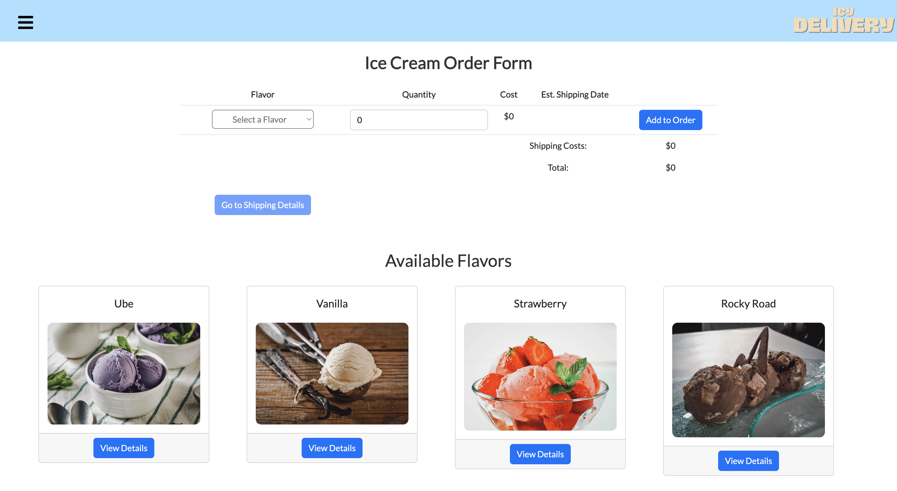
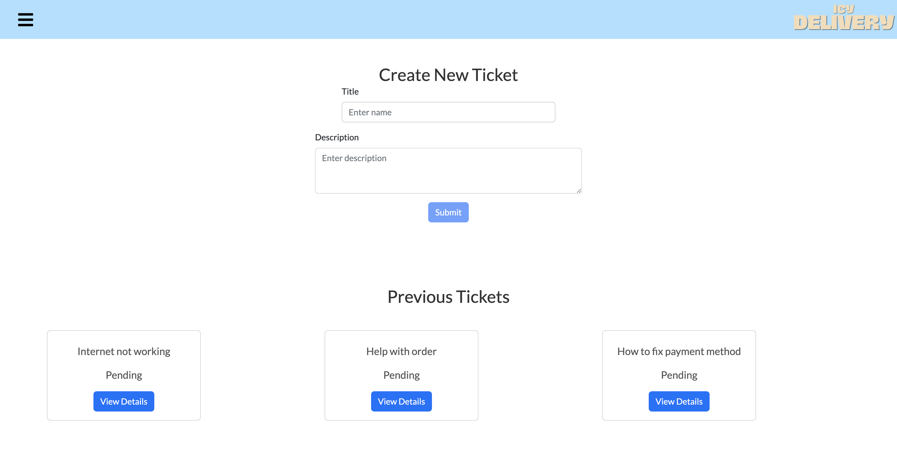
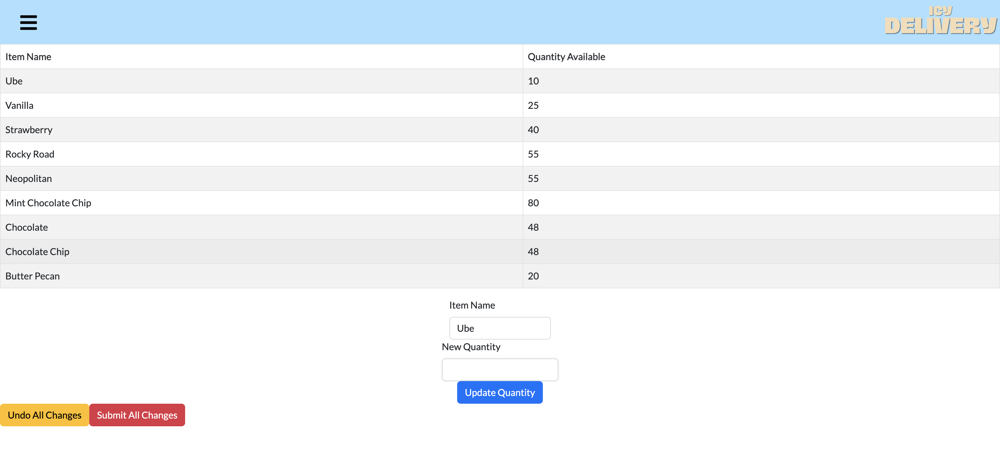
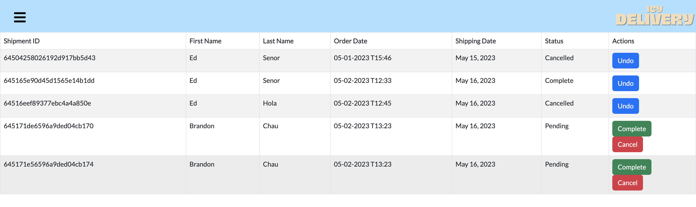

# Icy Delivery (CS 532 Project)

## Goal 
Implement CRUD functionality for account, orders, and trouble tickets. Admin accounts will have different permissions and viewing options. Overall, an ecommerce experience is the primary objective. 

## Setup 
`npm install i` to install any absent dependencies/libraries

`npm start` to start frontend

`nodemon index.js` or `node index.js` to start backend

## Screenshots

